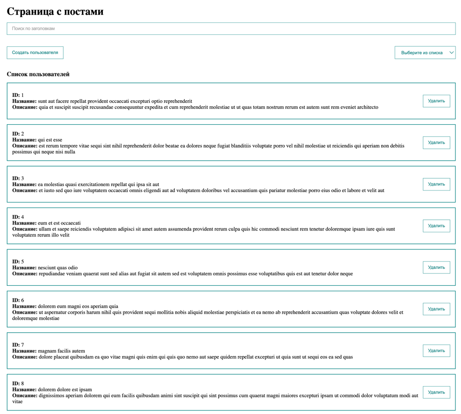
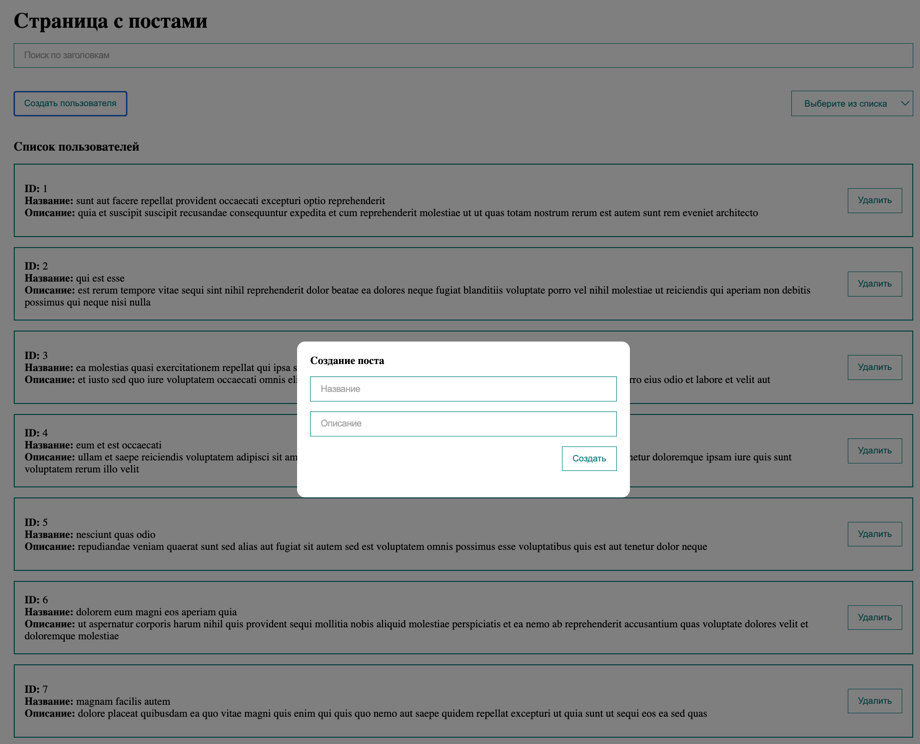

# Vue Posts

Список постов, который написан на Vue 3.\
Реализовано создание новых постов,
сортировка, фильтрация данных, бесконечный скролл с подгрузкой данных с бэка,
плюс реализована анимация при фильтрации или сортировке данных. 

## Стек проекта

**Client:** Vue, Axios, Eslint, Prettier.


## Установка

Установка зависимостей для vue3-posts, через npm

```bash
  npm install vue3-posts
  cd vue3-posts
```
### Команда для запуска проекта
```
npm run serve
```

### Команда для запуска билда
```
npm run build
```

### Команда для запуска линтера
```
npm run lint
```

## Скриншоты




